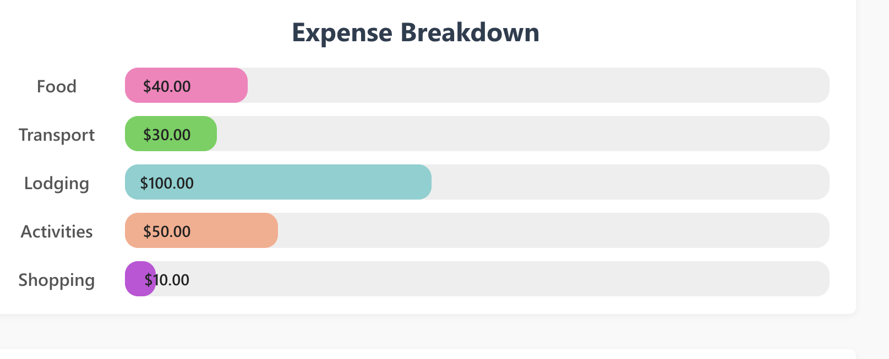
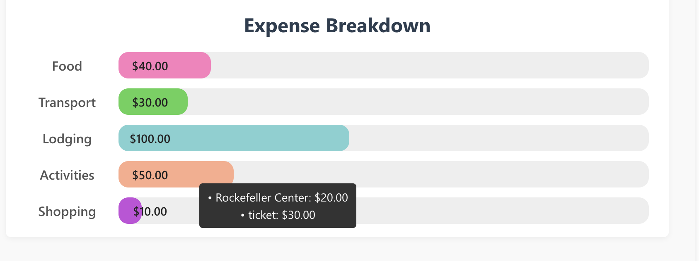

# metau-capstone
Project Plan Template: https://docs.google.com/document/d/1YzbyN8gPTGPaqeyhYOopU0tIa2KFumlLynaGox_u1uk/edit?usp=sharing

App Description: Travel app that makes it easy for users to plan trips with following features:
- Adding trips 
- Creating and generating itineraries
- Suggestion on tourist attractions
- Adding notes
- Expense tracker with budgeting tips

Requirements:
Cursor Interaction:code:https://github.com/Reena506/metau-capstone/blob/main/frontend/src/components/ExpenseTracker.jsx#L298-L350
 
Complex Visual Styling:code:https://github.com/Reena506/metau-capstone/blob/main/frontend/src/components/ExpenseTracker.jsx#L298-L350

